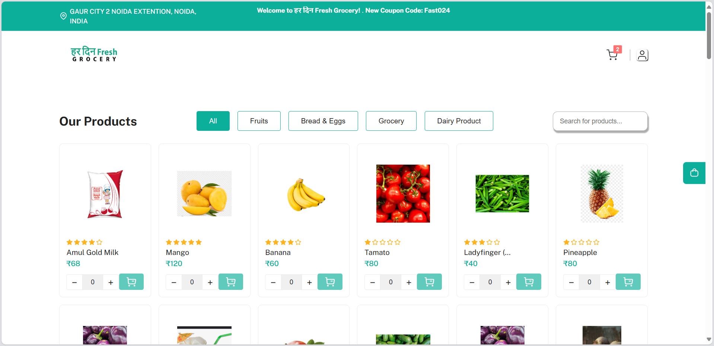
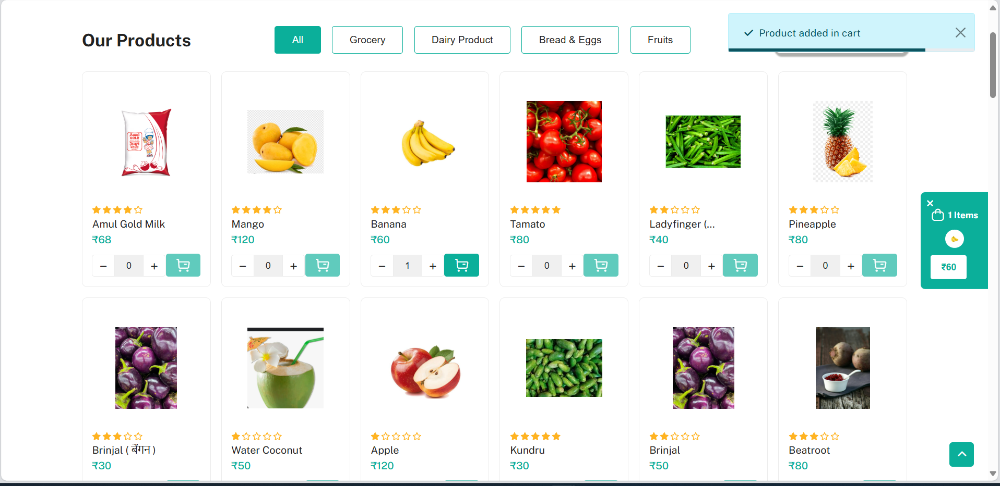
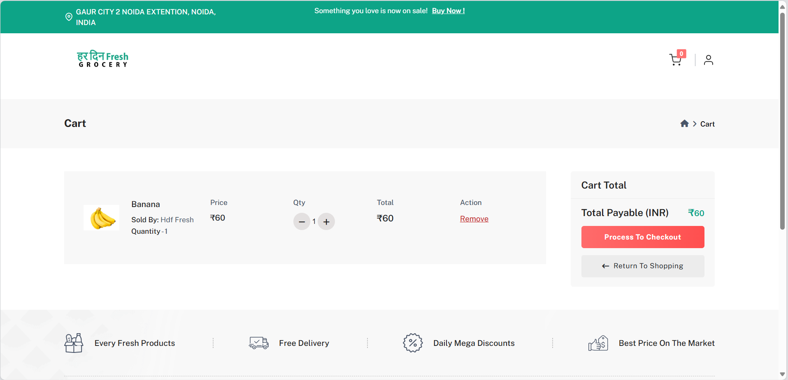
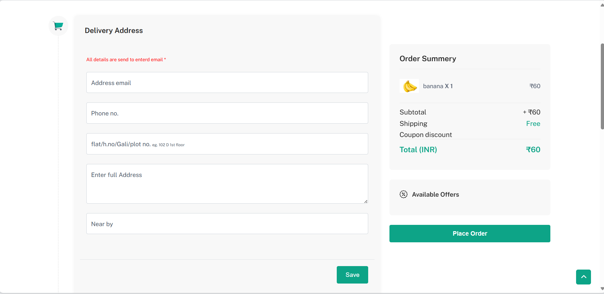
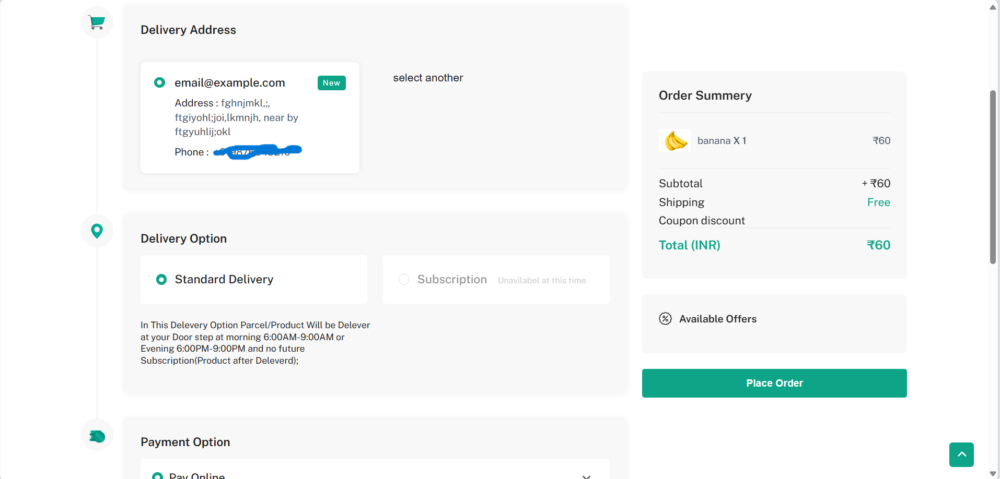
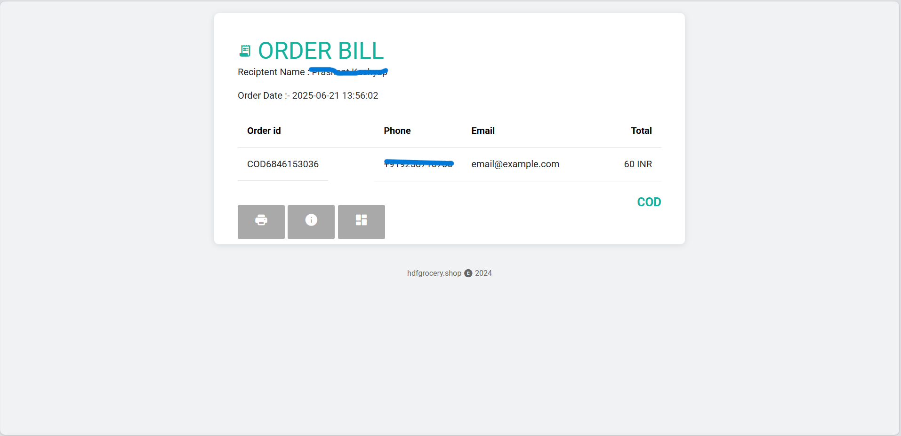

# 🛒 HDF Grocery – PHP E-commerce Store

**HDF Grocery** is a dynamic grocery store web application built using PHP and MySQL, designed for small to medium-sized vendors. It provides product browsing, cart management, order placement, payment integration (Cashfree), and an admin panel (hidden by `.gitignore`).

---

## 📌 Features

- 🧾 User login & session management via cookies
- 🛍️ Cart and order management
- 💸 Payment integration with Cashfree (test/live)
- 📦 Order tracking and status updates
- 🧑‍💼 Admin panel for inventory and orders (ignored from GitHub)
- 💾 Secure `.env`-based configuration support

---

## 🧰 Technologies Used

- **Frontend**: HTML, CSS, JavaScript
- **Backend**: PHP 7+
- **Database**: MySQL
- **Payment Gateway**: Cashfree
- **Web Server**: Apache (XAMPP recommended)

---

## 📁 Project Structure
```gro/
  ┣ /asset # UI assets and images
  ┃ ┗ /public # 🔒 Admin panel (ignored from Git)
  ┣ /cash3 # Cashfree checkout integration
  ┣ /partials # Reusable PHP includes
  ┣ /view # view orders details
  ┣ confi.php # 🔒 DB config (ignored)
  ┣ .env # 🔒 Environment secrets (ignored)
  ┣ .env.example # ✅ Safe public config template
  ┣ index.php # Home page
  ┣ 404.php # 404 Error page
  ┣ addcart.js # cart functions js file
  ┣ address.php # address fetching
  ┣ cart.php # cart page
  ┣ checkout.php # checkout page
  ┣ contact.php # contact page
  ┣ dash7efascri.js # handle js functions
  ┣ dashboard.php # Dashboard page
  ┣ deletecart.js # handle cart remove logic
  ┣ env.php # fetch creditionals from .env
  ┣ errorReport.php # error handling file
  ┣ fetchadd.php # address fetching file
  ┣ fetchcart.php # cart product fetching file
  ┣ global.php # global BASE_URL file
  ┣ i_demo.php # demo home page
  ┣ input.js # handle cart adding feature and other js functions
  ┣ logout.php # logout page
  ┣ my_order.php # order fetching page
  ┣ order2.php # order redirection page
  ┣ redirect.php # Redirection handle file
  ┣ remove_address.php # Address remove file
  ┣ remove_from_cart.php # cart product removing file
  ┣ result.php # Checkout result page
  ┣ search.php # order search page
  ┣ secure-checkout.php # checkout logic file
  ┣ update_cart.php # cart updation logic page
  ┣ updateProfile.php # Profile Update page
  ┣ verify.php # handle login/signup logic page
  ┗ README.md
```
  
---

## 🚀 Getting Started (Local Setup)

### 1. Clone the Repository

```bash
git clone https://github.com/hostingbird/HDF-Grocery.git
cd HDF-Grocery
```
### 2. Setup .env file
```
DB_USERNAME = USERNAME
DB_HOST = HOST
DB_PASS = PASSWORD
DB = DATABASE
PORT=PORT

CASH_PORD_Client = CASHFREE_PRODUCTION_CLIENTID
CASH_PORD_SCR = CASHFREE_PRODUCTION_SCRSET
CASH_TEST_Client = CASHFREE_TEST_CLIENTID
CASH_TEST_SCR = CASHFREE_TEST_SCRSET

BASE_URL=BASE_URL
```
3. Import the Database
Open phpMyAdmin

Create a new DB (e.g., hdf)

Import the SQL dump (/u328200287_hdf.sql or custom)

4. Start Local Server
Using XAMPP/Laragon:

Place project in htdocs

Access via http://localhost/gro/

🌐 Hosting Deployment
This project requires:

PHP-compatible hosting (e.g., Hostinger, 000webhost, InfinityFree)

MySQL database setup

Environment variables configured or hardcoded in config.php

⚠️ Security Notes
API Keys & secrets are NOT included — use .env for local testing

/asset/public/ and admin panel are intentionally hidden via .gitignore

Never push .env or secret keys to public repos

📷 Screenshots

## 📷 Screenshots

### 🏠 Homepage


### 🛒 Cart Page


### 💳 added cart 


### 💳 Checkout info Page


### 💳 Checkout Page


### 🧑‍💼 Oder Conform



📄 License
This project is open-source. Modify freely for learning or business (with attribution).

👨‍💻 Author
Shivam @hostingbird
✉️ Contributions & forks are welcome!


Then push it to GitHub:

```bash
git add README.md
git commit -m "Added full README.md with setup instructions"
git push
```


